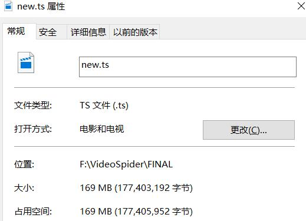

# 1024Video-Crawler
A python crawler for 1024 jap video from a mystery website. (No url)

用python编写爬虫抓取你懂得日本小电影（我是不会说出网址的……）

### 环境
python 3.6

### 爬虫工具
依旧采用了requests+BeautfulSoup的组合。request负责采集网络信息，BeautifulSoup负责进行信息处理

### 原因与目的
该小项目的主要目的是熟悉python语言，练习网络爬虫的使用，无其他目的

选取该网站的原因主要是考虑到这类网站对于视频的保护措施相对较弱。尝试解析过国内视频网站（如爱奇艺、优酷）等网站，受到会员制度等各种限制，抓取难度较大，
因此暂时采用该网站进行采集训练。

在代码中已经将相应url删除。

### 过程与问题
使用chrome浏览器开发者工具对于网站进行分析，发现该网站将视频分为了很小的片段进行传输，并且传输url隐藏在m3u8文件中，因此需要在开发者工具栏的network中
获取真正的url，下载得到众多.ts文件，然后使用 copy/b 命令进行合并。 为了保证合并顺序，需要在下载.ts文件时注意一下命名方式。为了使程序最大限度的自动化，
减少人工操作，我将执行命令行语句也写入到了代码当中。下载完成后，自动合并，将最终文件放入指定文件夹，并将使用过的.ts文件片段删除。

现在，使用这个crawler下载一部1024小电影（在该指定网站上），需要提供
1. 该电影的url（这个不能再省略了吧……）
2. 加载视频片段时发出 GET 请求的真实url（或者headers也有包含）

第一个url我们直接在浏览器复制就好，这个没什么问题。

真正的问题来了，如何让程序自动获得第二个url？ 我在相应页面的源代码中尝试过多种形式的查找，均没有找到相关信息，因此问题转换成了：如何使用python
监听网页的请求（视频有播放按钮，应该可以用selenium模拟点击），获取headers或者url信息（抓包？）。 我，，，，，目前还没有找到解决办法/(ㄒoㄒ)/~~

### 效果图

-----

## 2017.12.25更新
 - 新增了动态代理
 - 新增了m3u8解析，无需再使用Chrome开发者工具

今天整理项目适合，又看到了这个将近半年前的项目，想到上面提到的问题，始终觉得像是心病，不解决了感觉不舒服。
尝试了browsermobProxy嗅探网页network traffic信息，未果，毕竟是基于java的工具，对于python不少很友好
最终使用m3u8的python解析包对于m3u8进行了很好的解析，获得了视频真实地址，并且对于之前的视频片段数目的计算方式有了更好的计算方式。

测试过程中IP被封锁，不得不使用了动态代理，问题驱动是最好的实践。

具体实现过程参见CSDN传送门：http://blog.csdn.net/JosephPai/article/details/78897370
